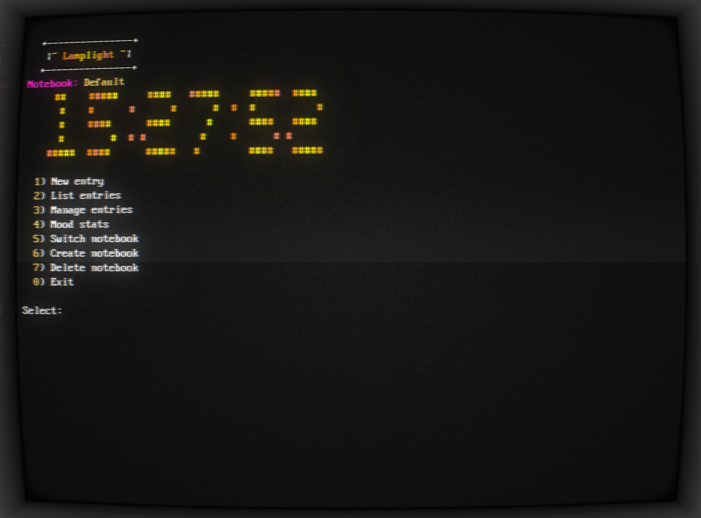

# Lamplight

Your terminal-native journal and mood tracker. Fast, minimal, and keyboard-driven.

Lamplight lets you capture daily thoughts, track mood over time, and organize entries in notebooks — all from a beautiful TUI that runs anywhere Bash runs.



## What you can do

- **Capture entries quickly**
  - One-key "New entry" flow with a lightweight live editor (no external editor required)
  - **Quick entry** mode (`Q`) for minimal-prompt journaling
  - Auto-stamped headers: date, mood, optional title and tags

- **Track your mood**
  - Enter free text or a numeric mood (1–10)
  - **Mood stats** with visual bar charts and averages
  - Color-coded mood display throughout the app

- **Organize with notebooks**
  - Create, switch, and delete notebooks to separate themes/projects
  - Active notebook is remembered between sessions

- **Manage past entries**
  - List entries with date, mood, title, and content preview
  - View, edit, or delete any entry from the TUI

- **Search your history**
  - Filter by date range, mood (number/keyword/range), and text query
  - Search within the active notebook or across all notebooks

- **Export, Import & Backup**
  - Export notebooks to JSON, Markdown, or plain text
  - Import entries from JSON exports
  - Full backup and restore of all data

- **Polished terminal UI**
  - Flicker-free header with animated gradient title
  - Big ASCII clock display (toggleable)
  - Clear keyboard hints and responsive menus
  - Customizable settings and themes

## Quick start

Requirements: Bash 4+ (macOS/Linux), a standard terminal, and basic POSIX tools.

### Install globally (recommended)

```bash
bash install.sh
```

This adds `lamplight` to your PATH so you can run it from anywhere.

### Or run directly

```bash
bash bin/lamplight
```

### Keyboard shortcuts

**Main Menu:**
- `1-8` — Select menu options
- `Q` — Quick entry (minimal prompts)
- `E/I` — Export/Import
- `B/R` — Backup/Restore
- `S` — Settings
- `H` — Help
- `0` — Exit

**Editor:**
- Arrow keys — Navigate
- `Enter` — New line
- `Backspace` — Delete
- `Tab` — Insert spaces
- `Page Up/Down` — Scroll
- `Ctrl+N` — Toggle line numbers
- `Ctrl+D` — Save and exit
- `Q` — Quit (read-only mode)

Your data lives under `~/JournalEntries/` (organized by notebook).
Exports go to `~/LamplightExports/`, backups to `~/LamplightBackups/`.

## Project structure

```
bin/
  lamplight           # Single entrypoint
lib/
  config.sh           # Configuration, constants, initialization
  domain/
    entry.sh          # Entry parsing, formatting, validation
    notebook.sh       # Notebook helpers
  usecase/
    new_entry.sh      # Create entries
    list_entries.sh   # List entries
    search_entries.sh # Search/filter
    manage_entries.sh # View/edit/delete
    mood_stats.sh     # Mood statistics
    notebooks.sh      # Notebook management
    export_import.sh  # Export, import, backup, restore
    settings.sh       # Settings, help, statistics
  infrastructure/
    ui_tui.sh         # TUI helpers, animations
    editor.sh         # Live editor with scroll support
  interface/cli/
    menu.sh           # Main menu and navigation
```

## Configuration

- Active notebook: `~/.simjournal_active_notebook`
- Settings: `~/.lamplight_settings`
- Journal data: `~/JournalEntries/`

## Notes

- Lamplight remembers your currently active notebook between sessions
- Settings persist across restarts (clock display, theme, preferences)
- All data is stored as plain text files for easy access and portability
